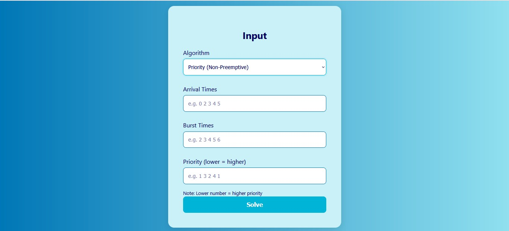
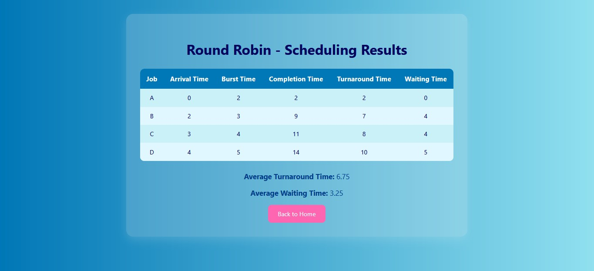

# OS Process Scheduler

A web-based Operating System Process Scheduler built using **Flask (Python)** for the backend and **HTML/CSS** for the frontend. This project simulates how different CPU scheduling algorithms work by taking user input and displaying the scheduling results clearly.

## 🔧 Features

- Simple and interactive web interface for simulating process scheduling
- Implements the following CPU scheduling algorithms:
  - **FCFS** (First Come First Serve)
  - **SJF** (Shortest Job First – Non-Preemptive)
  - **SRTF** (Shortest Remaining Time First – Preemptive SJF)
  - **Round Robin (RR)**
  - **Priority Scheduling**
    - Non-Preemptive
    - Preemptive
- Displays:
  - Execution order of processes
  - Waiting time
  - Turnaround time
  - Average waiting and turnaround times

## 🚀 Tech Stack

- **Backend**: Python (Flask)
- **Frontend**: HTML, CSS

## 📁 Project Structure

project-folder/
├── static/ # CSS and static files
├── templates/ # HTML templates
├── app.py # Main Flask application
├── fcfs.py # FCFS scheduling logic
├── sjf.py # SJF scheduling logic
├── srtf.py # SRTF scheduling logic
├── rr.py # Round Robin scheduling logic
├── priority_preemptive.py # Preemptive Priority scheduling logic
├── priority_non_preemptive.py # Non-Preemptive Priority scheduling logic
└── README.md # Project documentation

## 📸 Screenshots

Below is a preview of the process scheduler interface:

